# Treasure hunt stickers

Stickers hidden around the site for the sticker hunt. Every file in `src/assets/stickers/` is a
sticker (WhatsApp sticker WebPs, 512×512); the ones with a placement are registered by id in
`src/treasureHunt.ts` and rendered through the components in `src/components/treasureHunt/`.

A dismissible banner above the header announces the hunt (`HuntBanner.astro`). Stickers render
with an empty `alt` and no "treasure hunt" text in the markup, and are generated at 256px or
larger so they stay sharp when zoomed. Everything that remembers state (banner dismissal,
visited pages, page-load count) lives in the visitor's `localStorage`, so it is per browser.

## Placed stickers

| Sticker | File | Id | Page | How to trigger |
| --- | --- | --- | --- | --- |
|  | `alberto-drawer` | `alberto-drawer` | Coaches | Open Alberto's profile drawer; sticker sits in the top-left corner. |
| 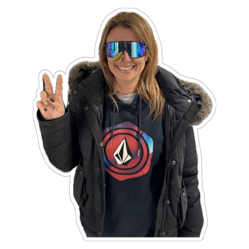 | `lis-drawer` | `lis-drawer` | Coaches | Open Lis's profile drawer; sticker sits in the top-left corner. |
| 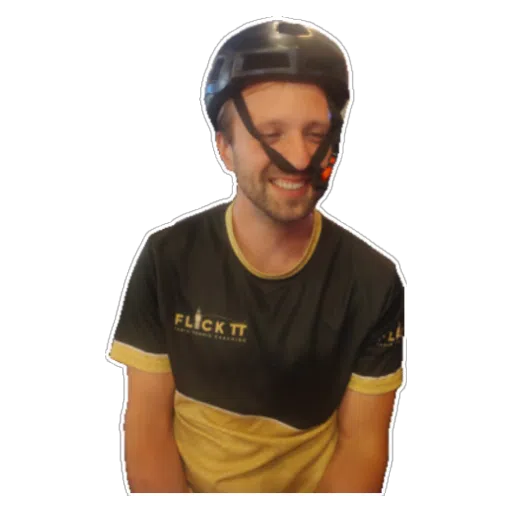 | `martin-drawer` | `martin-drawer` | Coaches | Open Martin's profile drawer; sticker sits in the top-left corner. |
| 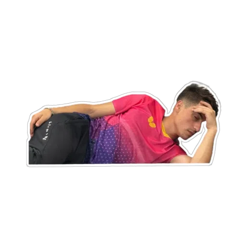 | `404-alberto` | `404-alberto` | 404 page | Visit any URL that doesn't exist; one of the six 404 stickers is picked at random per load. |
|  | `404-isaac` | `404-isaac` | 404 page | As above. |
|  | `404-jess` | `404-jess` | 404 page | As above. |
| 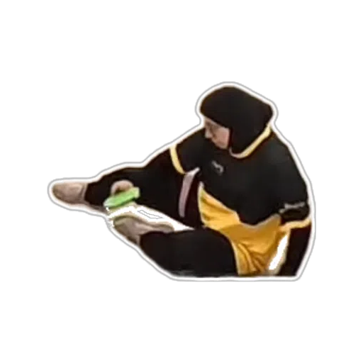 | `404-leena` | `404-leena` | 404 page | As above. |
|  | `404-mark` | `404-mark` | 404 page | As above. |
|  | `404-shreyansh` | `404-shreyansh` | 404 page | As above. |
| 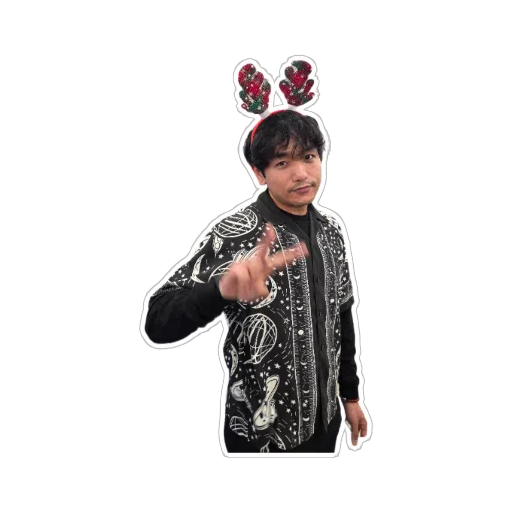 | `sid-1` | `sid-footer` | Every page (footer) | Hover or click/tap "Sid Gurung" in the footer credit; pops up above the name. |
|  | `may-workshop` | `may-workshop` | Membership | Hover or click/tap "Free" in the Workshop row of the benefits table (or mobile card). |
|  | `mark-1` | `mark-about` | About | Hover or click/tap "Mark Lee" in the contacts list. |
|  | `isaac-1` | `isaac-whatsapp` | Every page (footer) and About | Hover the WhatsApp icon, or long-press it on touch (the press doesn't open WhatsApp). |
|  | `lis-3` | `lis-smiley` | Membership | Hover the smiley-face icon in the points row to flip it over; click/tap toggles it. |
| 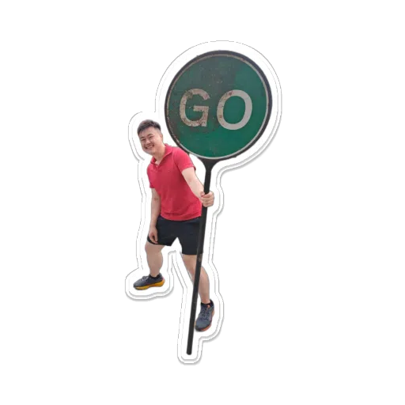 | `mark-go` | `mark-go` | Compete › Club League | Front of the card in the top-right corner of the "Currently Active" box. |
| 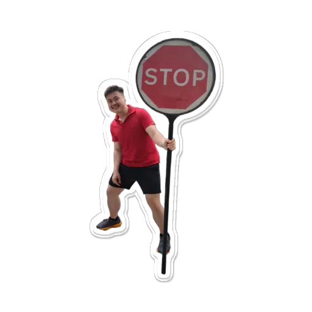 | `mark-stop` | `mark-stop` | Compete › Club League | Back of that card: each click flips it; moving the mouse onto it flips it once too. |
| 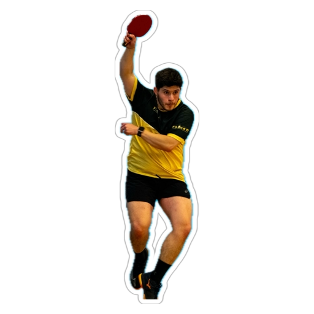 | `brandon-1` | `brandon-tournament` | Compete › Tournament | Scroll to the very bottom of the page; springs up from the bottom edge for 1.5 s. Re-arms after scrolling away. |
| 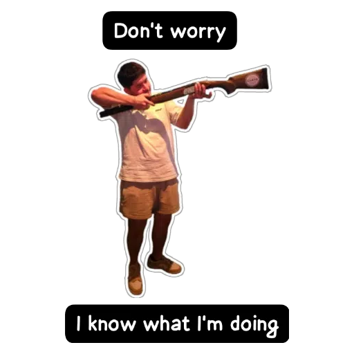 | `brandon-2` | `brandon-level1` | Offerings › Group Sessions | Open the "LEVEL 1 — Solid foundations" accordion; sits in the top-right corner with the text wrapping around it. |
|  | `burger` | `burger-menu` | Every page (mobile menu) | Open the mobile nav menu; the toggle button inside it shows the burger instead of the hamburger icon. |
|  | `ben-popout` | `ben-schedule` | Home | Swipe/scroll the schedule to its right-hand end; slides in from the right edge for 1.5 s. Below the `xl` breakpoint only (the schedule doesn't scroll on wide screens). |
|  | `david-popout` | `david-schedule` | Home | Swipe/scroll the schedule back to its left-hand end; slides in from the left edge for 1.5 s. |
|  | `leena-fall` | `leena-shake` | Every page | Shake the phone hard (four strong jolts within 1.5 s); slides down from the top and fades after 3 s. Android works as is; iOS asks for motion permission on the first tap. |
|  | `lis-4` | `lis-reward` | Every page | Visit every page of the site (all 17, not the 404); a card with the sticker appears at the bottom and follows you until dismissed. Dismissing resets the count so the round can be done again. |
|  | `leena-hello` | `leena-hello` | Every page | From the 20th page load on, each load has a 10% chance of a greeting card ("Hello!") that fades after 3 s. |
| 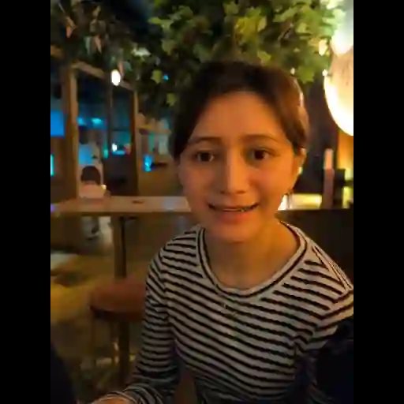 | `may-hello` | `may-hello` | Every page | As above ("Hello!"). |
| 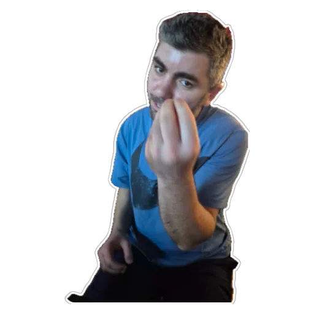 | `umberto-1` | `umberto-hello` | Every page | As above ("Che?"). |
|  | `brandon-4` | `brandon-hello` | Every page | As above ("How you doin'?"). |

## Not placed yet

| Sticker | File | Notes |
| --- | --- | --- |
|  | `alberto-1` | |
|  | `alberto-2` | |
|  | `alberto-3` | |
| 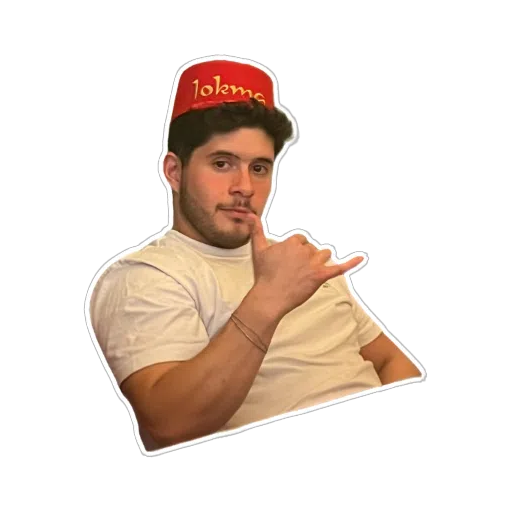 | `brandon-3` | |
|  | `charles-1` | |
|  | `charles-2` | |
| 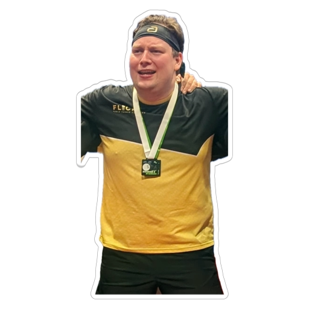 | `charles-3` | |
| 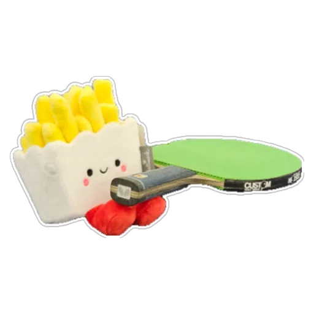 | `chips` | Pairs naturally with `burger`. |
|  | `david-1` | |
| 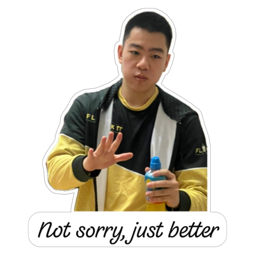 | `isaac-2` | |
|  | `isaac-3` | |
|  | `jess-1` | |
|  | `jess-2` | |
|  | `lis-1` | |
|  | `lis-5` | |
|  | `lis-clap` | |
|  | `mark-2` | |
| 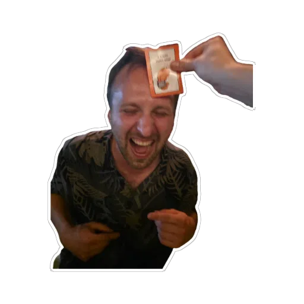 | `martin-1` | |
| 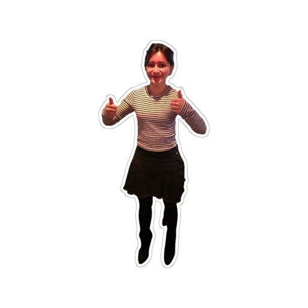 | `may-1` | |
|  | `may-2` | |
| 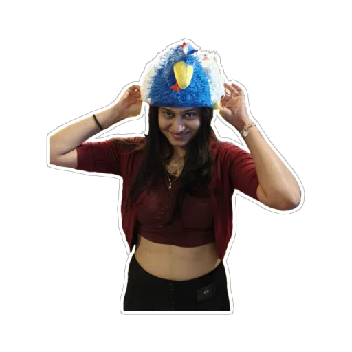 | `neha-1` | |
|  | `shreyansh-1` | |
|  | `shreyansh-2` | |
|  | `shreyansh-3` | |
|  | `shreyansh-4` | |
|  | `sid-2` | |
| 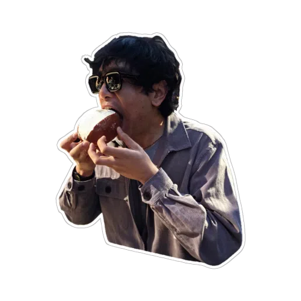 | `sid-3` | |

## Mechanics

Each placement is one of these components (all in `src/components/treasureHunt/`):

| Component | Behaviour |
| --- | --- |
| `Sticker` | Plain sticker `` at a given size; the building block for the rest. |
| `RandomSticker` | Renders one of several ids, chosen client-side on every load (404 page). |
| `RevealSticker` | Wraps a word or icon; the sticker pops up above it on hover, and click/tap toggles it. `hoverOnly` for content inside links (long press on touch instead of tap). |
| `FlipSticker` | Flip card with slotted content on the front and a sticker on the back; hover shows the back, click toggles. |
| `ToggleSticker` | Flip card with a sticker on each face; click and mouse-enter each flip it. |
| `PopoutSticker` | Fixed to a viewport edge, slides in on a trigger: `page-end`, `scroll-edge` (a horizontal scroller reaching an edge) or `parent-dialog` (its `<dialog>` opening). |
| `ShakeSticker` | Drops from the top when the phone is shaken hard. |
| `VisitedAllSticker` | Dismissible reward card once every page has been visited. |
| `GreetingSticker` | Occasional random captioned greeting after a number of page loads. |
| `HuntBanner` | The announcement strip above the header. |

The flip cards use a 2D squash-and-swap (`flipCard.ts`) rather than a 3D rotation, because
browsers rasterise 3D-transformed layers once at their on-page size and the stickers would stay
blurry under zoom.

## Adding a sticker

1. Drop the WebP into `src/assets/stickers/` (512×512, like the others).
2. Import it in `src/treasureHunt.ts` and add an entry to `STICKERS` under a descriptive id.
3. Place it with one of the components above, and add a row to the table here.
